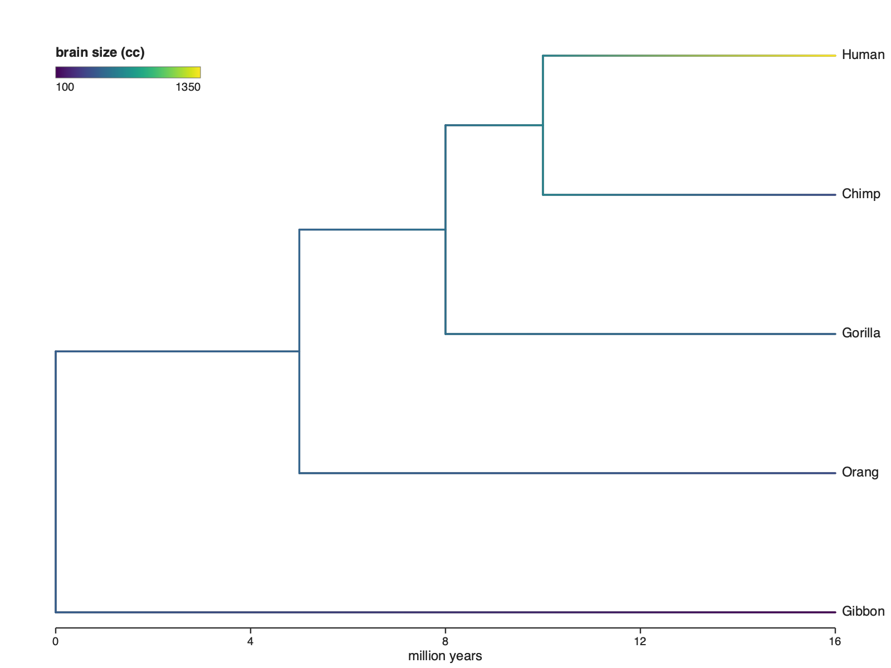

# Phylustrator

A small, composable plotter for phylogenetic trees. Read a Newick tree, build a figure by adding
layers, and save it to SVG, PDF, or PNG.



## Install

```bash
pip install git+https://github.com/AADavin/Phylustrator
```

SVG output needs nothing else; for PDF/PNG also install `cairosvg` (`pip install cairosvg`).

## Quick start

```python
import phylustrator as ph

tree = ph.loads("((((Human:6,Chimp:6)a:2,Gorilla:8)b:3,Orang:11)c:5,Gibbon:16)root;")
brain = {"Human": 1350, "Chimp": 400, "Gorilla": 500, "Orang": 400, "Gibbon": 100,
         "a": 650, "b": 560, "c": 500, "root": 470}

(ph.plot(tree)
 + ph.color_branches(brain)
 + ph.tip_labels()
 + ph.colorbar("brain size (cc)")
 + ph.time_axis("million years")).save("tree.png")
```

That is the whole idea: `plot(tree)` starts a figure and each `+ layer` adds one decoration.

- **Layouts** — `rectangular` (default), `radial`, `unrooted`.
- **Layers** — `color_branches`, `tip_labels`, `node_labels`, `tip_track`, `colorbar`, `legend`,
  `time_axis`, `scale_bar`, `highlight_clade`.
- **Dependencies** — only `drawsvg` (plus `cairosvg` for PDF/PNG).

## License

MIT — see [LICENSE](LICENSE).
